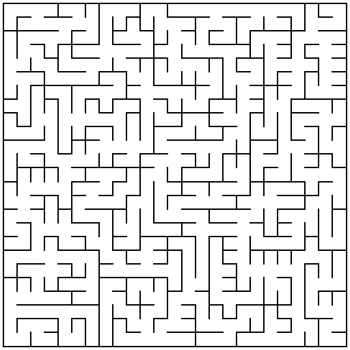
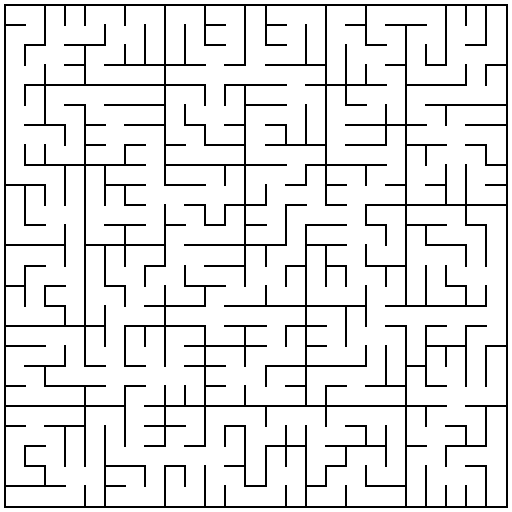
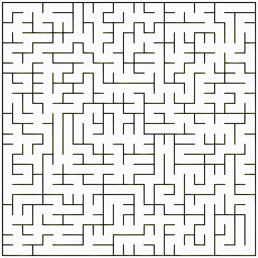

# Procedural

##Maze
Used for maze generation. By using spanning trees is is guaranteed, that there is always a possible path between any two points in the maze.
### Samples
Simple random maze:
```java
MazeGenerator.generateMaze(25, 25, MazeGeneratorPriorities.random(new Random()));
```


Interpolated maze that changes from a 4x4 box pattern in the upper left corner to a 5x5 box pattern in the lower right corner:
```java
MazeGenerator.generateMaze(25, 25,
		MazeGeneratorPriorities.interpolate(
				MazeGeneratorPriorities.interpolate(
						MazeGeneratorPriorities.box(4), MazeGeneratorPriorities.box(5), m -> m.from.x + m.from.y < 25 ? 0 : 1),
				MazeGeneratorPriorities.random(new Random()), 0.01));
```


Interpolated maze where a box pattern emerges from a random maze over time:
```java
final int frames = 600;
for (int i = 0; i <= frames; i++) {
	MazeGenerator.generateMaze(25, 25,
			MazeGeneratorPriorities.interpolate(
					MazeGeneratorPriorities.random(new Random()),
					MazeGeneratorPriorities.interpolate(
							MazeGeneratorPriorities.randomize(MazeGeneratorPriorities.box(5), new Random()),
							MazeGeneratorPriorities.random(new Random()),
							0.01),
					(double)i / frames));
}
```
